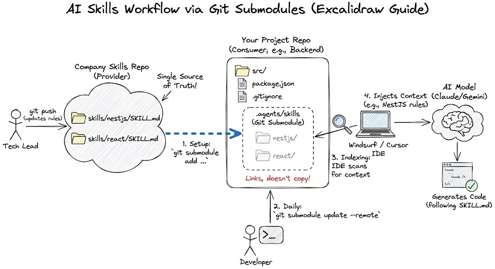

# Agents Skills

This repo is a centralized skills registry for AI agents.

It stores versioned `SKILL.md` files by stack/domain, plus a `registry.json` index and CLI scaffolding for distribution. Teams update skills here via PRs, then consumer projects pull updates (for example via Git submodules).

## Workflow Diagram



## Use Skills

### Quick start

Required: **Git**.

If your project uses this repo as a submodule (as shown in the diagram), your agent can consume skills without local Python/Node setup.

## Contribute Skills

### Setup (optional)

Use these tools only if you are editing this repository:

- Python 3.x (for pre-commit)
- Node.js (only if you use Node-based tooling/plugins)

```bash
# Install pre-commit
pip install pre-commit

# Install git hooks
pre-commit install

# Run checks manually
pre-commit run --all-files
```

### Repository layout

```text
skills/
registry.schema.json
registry.json
cli/
```

- `skills/`: skill definitions and related assets/templates
- `registry.schema.json`: JSON Schema contract for registry entries
- `registry.json`: source-of-truth index used by registry-aware tooling/CLI
- `cli/`: placeholder for future install/update tooling

### Practical workflow

1. Update or add skill files in this repo.
1. Open a PR and review changes.
1. Consumer projects pull updates (for example: `git submodule update --remote`).
1. IDE agents re-index and apply updated guidance from `.agents/skills`.

### Contributing

1. Create a branch.
1. Make focused changes.
1. Run `pre-commit run --all-files`.
1. Open a PR with a clear summary of skill changes.

### License

TODO: Add license information.
