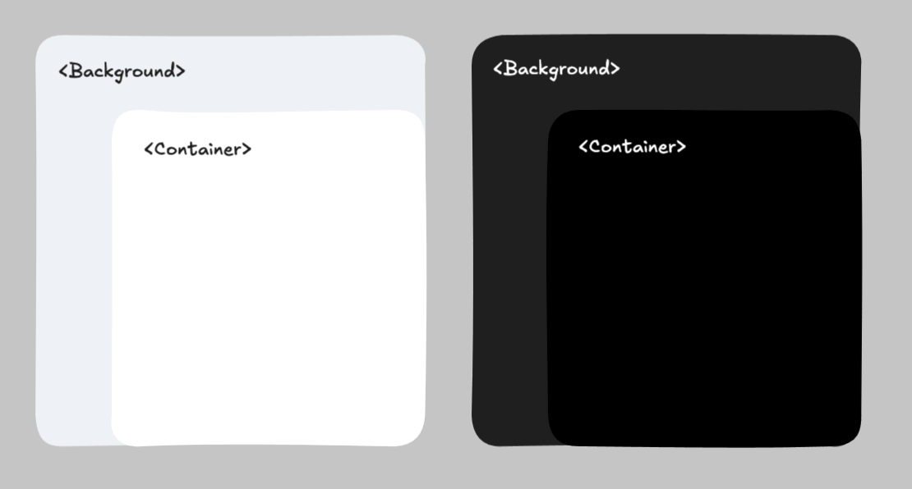

# Using sloth-ui-mobile

This skill provides instructions for using the `@rapid-recovery-agency-inc/sloth-ui-mobile` design system library in the insightt-mobile app.

For the complete component catalog and Figma design links, see `references/component-catalog.md`. If you need UI components from react-native core, analyze component catalog first.

## Preferences

1. **SHOULD AVOID** using hardcoded color values (hex, rgb, rgba) in styles. Use theme color tokens instead.
1. **SHOULD AVOID** using inline styles. Use `createThemeStyleSheet` + `useThemedStyles` instead.
1. **SHOULD AVOID** creating styles with `font-*` or `color` properties directly. Use `MainText` or theme tokens.
1. **SHOULD AVOID** using deprecated components.
1. **PREFER** importing all components from `'@rapid-recovery-agency-inc/sloth-ui-mobile'`.
1. **PREFER** using `createThemeStyleSheet` instead of `StyleSheet.create` to ensure theme compatibility.
1. **PREFER** using `MainText` for all text rendering, never raw `<Text>` from React Native.
1. **PREFER** using the `themeColor` prop on `MainText` and `Icon` — the `color` prop is **deprecated** on both.
1. **PREFER** using `<Background>` and `<Container>` for layout structure instead of manually setting background colors on `<View>`.
1. **PREFER** using the `LoaderV2` component instead of `ActivityIndicator`.
1. **PREFER** using the `DividerV2` component instead of a custom view.
1. **PREFER** using the `Button` component instead of `TouchableOpacity`.

## Theming System

The library uses semantic color tokens that automatically resolve to light/dark mode values. The theming pipeline is:

```text
createThemeStyleSheet → useThemedStyles → resolved StyleSheet
```

### Step 1: Define Styles with `createThemeStyleSheet`

Define styles outside the component. Use theme token names (strings) for any color-related property instead of hardcoded hex values.

Token-supported properties: `color`, `backgroundColor`, `borderColor`, `borderTopColor`, `borderRightColor`, `borderBottomColor`, `borderLeftColor`, `shadowColor`, `textDecorationColor`, `textShadowColor`, `tintColor`, `overlayColor`.

```typescript
import {
  createThemeStyleSheet,
  DeviceSize,
} from "@rapid-recovery-agency-inc/sloth-ui-mobile";

const styleSheet = createThemeStyleSheet({
  container: {
    backgroundColor: "bgSurfaceBase", // theme token, NOT a hex value
    padding: 16,
  },
  titleContainer: {
    marginBottom: 12,
    flexDirection: "row",
    alignItems: "center",
    backgroundColor: "bgSurfaceElevated",
    [DeviceSize.LG]: {
      padding: 24,
    },
  },
});
```

### Step 2: Consume Styles with `useThemedStyles`

Call `useThemedStyles` inside the component. It resolves theme tokens to actual colors AND applies responsive breakpoints.

```typescript
import { useThemedStyles } from '@rapid-recovery-agency-inc/sloth-ui-mobile';

const MyComponent = () => {
  const styles = useThemedStyles(styleSheet);
  return <View style={styles.container}>...</View>;
};
```

### Dynamic Styles (Factory Pattern)

`useThemedStyles` accepts either a style object or a factory function. The factory function receives the current `colors` object, allowing for dynamic logic:

```typescript
import { useThemedStyles, createThemeStyleSheet } from '@rapid-recovery-agency-inc/sloth-ui-mobile';

const MyComponent = ({ isActive }) => {
  const styles = useThemedStyles((colors) => ({
    container: {
      backgroundColor: isActive ? colors.bgBrandSoft : colors.bgSurfaceBase,
      borderWidth: 1,
      borderColor: colors.uiPrimary,
    },
  }));

  return <View style={styles.container} />;
};
```

### Using Colors Outside Styles

Don't use `useThemeColor` when you need a color value, create a new class object inside of createThemeStyleSheet and use it.

**PREFER**. useTheme() to get the colors object.

```typescript
import {
  createThemeStyleSheet,
  useThemedStyles,
  useTheme,
  Background,
  MainText
} from "@rapid-recovery-agency-inc/sloth-ui-mobile";

const Component = () => {
  const { colors } = useTheme();
  const styles = useThemedStyles(styleSheet);

  return (
    <Background style={styles.background}>
      <MainText themeColor="fgPrimary" type="BOOK_LG">Content here</MainText>
      <Icon iconName="check" size={18} color={styles.icon.color} />
    </Background>
  );
}

  const styleSheet = createThemeStyleSheet({
  background: {
    backgroundColor: colors.bgSurfaceElevated, // theme token, NOT a hex value
    padding: 16,
  },
  icon: {
    color: colors.fgPrimary,
  },
});
```

## Theme Color Tokens

Tokens follow a naming convention: `{category}{Semantic}`.

| Category | Purpose                          | Examples                                                                                                                                         |
| -------- | -------------------------------- | ------------------------------------------------------------------------------------------------------------------------------------------------ |
| `bg*`    | Background colors                | `bgSurfaceBase`, `bgSurfaceElevated`, `bgPrimaryElevated`, `bgAccent`, `bgBrandSoft`, `bgErrorSoft`, `bgSuccessSoft`, `bgWarningSoft`, `bgModal` |
| `fg*`    | Foreground colors (text & icons) | `fgPrimary`, `fgSecondary`, `fgBrandContrast`, `fgAlwaysWhite`, `fgAlwaysBlack`, `fgErrorContrast`, `fgSuccessContrast`, `fgWarningContrast`     |
| `ui*`    | Dual-purpose colors (bg or fg)   | `uiBrandSolid`, `uiPrimary`, `uiSecondary`, `uiErrorSolid`, `uiSuccessSolid`, `uiWarningSolid`                                                   |

Special tokens: `transparent` (always transparent), `bgPositionGold`/`Silver`/`Bronze` (leaderboard).

## Responsive Styles

`useThemedStyles` handles responsiveness automatically. Define breakpoint-specific overrides using `DeviceSize` keys inside any style:

```typescript
import {
  createThemeStyleSheet,
  DeviceSize,
} from "@rapid-recovery-agency-inc/sloth-ui-mobile";

const styleSheet = createThemeStyleSheet({
  container: {
    padding: 16, // default (all sizes)
    [DeviceSize.MD]: { padding: 24 }, // tablets
    [DeviceSize.LG]: { padding: 32 }, // large tablets
  },
});
```

Breakpoints: `XS` (\<400px), `SM` (≤700px), `MD` (700-1024px), `LG` (1024-1200px), `XL` (≥1200px).

### Device-Adaptive Component Rendering

Use `selectRenderV2` to render entirely different components for phone vs tablet:

```typescript
import { selectRenderV2 } from '@rapid-recovery-agency-inc/sloth-ui-mobile';

const MyScreen = () => selectRenderV2({
  NormalComponent: <PhoneLayout />,
  LargeComponent: <TabletLayout />,
});
```

`LargeComponent` renders on MD, LG, XL. `NormalComponent` renders on XS, SM.

### Responsive Breakpoints

| Breakpoint | Condition     | Use Case            |
| ---------- | ------------- | ------------------- |
| `XS`       | `<400px`      | Mobile phones       |
| `SM`       | `≤700px`      | Mobile phones       |
| `MD`       | `700-1024px`  | Tablets             |
| `LG`       | `1024-1200px` | Large tablets       |
| `XL`       | `≥1200px`     | Extra large tablets |

**PREFER** using for responsive design `isLargeDevice` over `DeviceSize`.

## Layout Components

Two backbone components ensure consistent background coloring and Dark Mode support for layout structure.



### `<Background>`

Represents the **base background** of a screen or section.

- Default style: `backgroundColor: 'bgSurfaceBase'`
- Use case: Top-level wrappers for screens

### `<Container>`

Represents a **content block** or card-like container.

- Default style: `backgroundColor: 'bgSurfaceElevated'`
- Use case: Cards, sections, list items
- Supports border shorthand props for quick styling

**Border Props** (all use `uiPrimary` color by default):

`borderTop`, `borderBottom`, `borderLeft`, `borderRight`, `borderHorizontal`, `borderVertical`, `borderAll`

**Allowed Style Props** (both components accept `ContainerViewStyle` — layout properties only):

`padding`, `margin` (and variations), `flex`, `flexDirection`, `justifyContent`, `alignItems`, `width`, `height`, `gap`, `borderRadius`

```typescript
import { Background, Container, useThemedStyles, createThemeStyleSheet, MainText } from '@rapid-recovery-agency-inc/sloth-ui-mobile';

const Component = () => {
  const styles = useThemedStyles(styleSheet);

  return (
    <Background style={styles.background}>
      <Container borderBottom style={styles.container}>
        <MainText themeColor="fgPrimary" type="BOOK_LG">Content here</MainText>
      </Container>
    </Background>
  )
}

const styleSheet = createThemeStyleSheet({
  background: {
    flex: 1,
  },
  container: {
    padding: 16,
  },
});
```

## Text Component

**MUST** use `MainText` for all text. Never use React Native's `<Text>` directly.

```typescript
import { MainText } from '@rapid-recovery-agency-inc/sloth-ui-mobile';

<MainText type="BOLD_LG" themeColor="fgPrimary">Hello</MainText>
<MainText type="BOOK_SM" themeColor="fgSecondary">Subtitle</MainText>
<MainText type="BLACK_XL" themeColor="fgBrandContrast">Heading</MainText>
```

### Text Type Format

`{Weight}_{Size}` where:

- **Weights:** `BLACK` (900), `BOLD` (700), `BOOK` (400)
- **Sizes:** `XXS` (10px), `XS` (12px), `SM` (14px), `MD` (16px), `LG` (18px), `XL` (20px), `XL2` (22px), `XL3` (24px), `XL4` (26px), `XL5` (32px), `XL6` (40px), `XL7` (48px), `XL8` (64px)

Font family: CircularStd (Black, Bold, Book).

### Text Color

```typescript
// ❌ Deprecated
<MainText color="primary" type="BOOK_LG">Hello</MainText>

// ✅ Correct
<MainText themeColor="fgPrimary" type="BOOK_LG">Hello</MainText>
```

## Icon Component

**MUST** use `themeColor` prop. The `color` prop is **deprecated**.

```typescript
import { Icon } from '@rapid-recovery-agency-inc/sloth-ui-mobile';

// ❌ Deprecated
<Icon iconName="user" color="#000" />
<Icon iconName="clock" color={Color.GRAY2} />

// ✅ Correct
<Icon iconName="user" themeColor="fgPrimary" />
<Icon iconName="clock" themeColor="fgSecondary" solid />
```

## Button Component

Buttons use theme colors internally for backgrounds and text.

```typescript
import { Button } from '@rapid-recovery-agency-inc/sloth-ui-mobile';

<Button text="Save" color="blue" size="lg" variant="solid" onPress={handleSave} />
<Button text="Cancel" color="grey" variant="transparent" onPress={handleCancel} />
<Button text="Delete" color="red" size="sm" loading={isDeleting} onPress={handleDelete} />
<Button leftIcon="plus" text="Add" color="green" onPress={handleAdd} />
```

**Props:**

- `size`: `'xl'` | `'lg'` (default) | `'sm'`
- `color`: `'blue'` (default) | `'grey'` | `'green'` | `'orange'` | `'red'`
- `variant`: `'solid'` (default) | `'transparent'`
- `loading`: shows spinner, disables press
- `disabled`: reduces opacity, disables press
- `leftIcon` / `rightIcon`: FontAwesome icon name (mutually exclusive)

> **Note:** `MainButton` and `PlainButton` are deprecated. Use `Button` for all new code.

## Common Components Quick Reference

| Component                                  | Use Case               | Key Props                                     |
| ------------------------------------------ | ---------------------- | --------------------------------------------- |
| `MainText`                                 | Text rendering         | `type`, `themeColor`                          |
| `Button`                                   | Actions, CTAs          | `text`, `color`, `size`, `variant`, `onPress` |
| `Icon`                                     | FontAwesome icons      | `iconName`, `size`, `themeColor`, `solid`     |
| `Background`                               | Screen base wrapper    | `style` (layout props only)                   |
| `Container`                                | Card / content block   | `style`, `borderTop`, `borderBottom`, ...     |
| `InputField` / `Input`                     | Text input             | Standard input props                          |
| `Dropdown`                                 | Select dropdown        | Options, selection callbacks                  |
| `Pill`                                     | Status labels          | `color`, `variant`, `size`                    |
| `Avatar` / `AvatarRow`                     | User avatars           | Name, image, size                             |
| `DividerV2`                                | Visual separators      | —                                             |
| `LoaderV2`                                 | Loading indicators     | —                                             |
| `ConfirmationModal`                        | Confirm/cancel dialogs | `title`, `message`, `onConfirm`               |
| `MainModal`                                | General modal          | `isVisible`, `onClose`                        |
| `Checkbox` / `Radio`                       | Selection controls     | `checked`, `onChange`, `size`                 |
| `Toggle`                                   | On/Off switch          | —                                             |
| `DatePicker`                               | Date range selection   | Date range model                              |
| `BlueTabs` / `FloatingTabs` / `SimpleTabs` | Tab navigation         | Tab items, selection                          |
| `Carousel` / `GridCarousel`                | Image/card carousel    | Items array                                   |
| `StatsCardBlue` / `StatsCardWhite`         | Dashboard stat cards   | Value, label, tendency                        |
| `NotesSection`                             | Notes display          | Notes data                                    |
| `UserDetails`                              | User info display      | Name, avatar, size                            |

## Complete Example

```typescript
import {
  createThemeStyleSheet,
  useThemedStyles,
  MainText,
  Button,
  Pill,
  Icon,
  Background,
  Container,
  DeviceSize,
} from '@rapid-recovery-agency-inc/sloth-ui-mobile';

export const VehicleCard = ({ vehicle, onSpot }: VehicleCardProps) => {
  const styles = useThemedStyles(styleSheet);

  return (
    <Background style={styles.background}>
      <Container borderBottom style={styles.card}>
        <View style={styles.header}>
          <MainText type="BOLD_LG" themeColor="fgPrimary">{vehicle.make}</MainText>
          <Pill color="green" variant="soft" size="sm">{vehicle.status}</Pill>
        </View>
        <MainText type="BOOK_SM" themeColor="fgSecondary">{vehicle.plate}</MainText>
        <View style={styles.actions}>
          <Icon iconName="camera" size={18} themeColor="fgSecondary" solid />
          <Button
            text="Spot Vehicle"
            color="blue"
            size="lg"
            leftIcon="camera"
            onPress={onSpot}
          />
        </View>
      </Container>
    </Background>
  );
};

const styleSheet = createThemeStyleSheet({
  background: {
    flex: 1,
  },
  card: {
    padding: 16,
    [DeviceSize.MD]: { padding: 24 },
  },
  header: {
    flexDirection: 'row',
    justifyContent: 'space-between',
    alignItems: 'center',
    marginBottom: 8,
  },
  actions: {
    marginTop: 16,
    paddingTop: 16,
    gap: 12,
  },
});
```

## Deprecated APIs

| Deprecated                   | Replacement                                         |
| ---------------------------- | --------------------------------------------------- |
| `MainButton` / `PlainButton` | `Button`                                            |
| `Color` constant object      | `ThemeColor` tokens via `createThemeStyleSheet`     |
| `StyleSheet.create()`        | `createThemeStyleSheet()`                           |
| `createResponsiveStyles()`   | `createThemeStyleSheet()` (has responsive built-in) |
| `useResponsiveStyles()`      | `useThemedStyles()` (has responsive built-in)       |
| `selectRender()`             | `selectRenderV2()`                                  |
| `MainText color` prop        | `MainText themeColor` prop                          |
| `Icon color` prop            | `Icon themeColor` prop                              |
